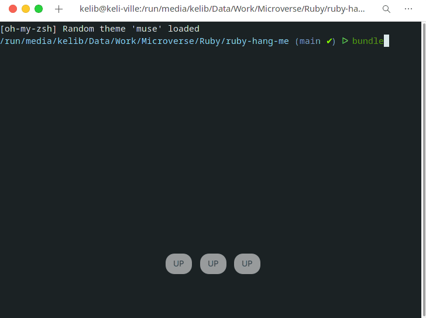

# Ruby-hang-me
A basic hangman game built with Ruby

## Description
- User type a letter to guess the hangman word
- The game ends when you guess wrong 3 times
- Users can type enter to end the game 

### Usage 
- Forking the project
- Cloning the project to your local machine
- `cd` into the project directory
- Run `git checkout -b your-branch-name`
- Make your contributions
- Push your branch up to your forked repository
- Open a Pull Request with a detailed description to the development branch of the original project for a review

## preview

## Built With

- Ruby

### How to get started

- run bin/main.rb

### How to play
- You have 3 chances
- Try to guess the correct word by entering a letter.
- The game ends when you have a correct guess or you when you guess wrong 3 times.

## Authors

👤 **Kelly Booster**

- Github: [@kelibst](https://github.com/kelibst)
- Twitter: [@keli_booster](https://twitter.com/keli_booster)
- Linkedin: [Kekeli (Jiresse) Dogbevi
](https://www.linkedin.com/in/kekeli-dogbevi-958272108/)

## 🤝 Contributing

Contributions, issues and feature requests are welcome!

## Show your support

Give a ⭐️ if you like this project!

## Acknowledgments

- Microverse

## 📝 License

This project is [MIT] licensed.